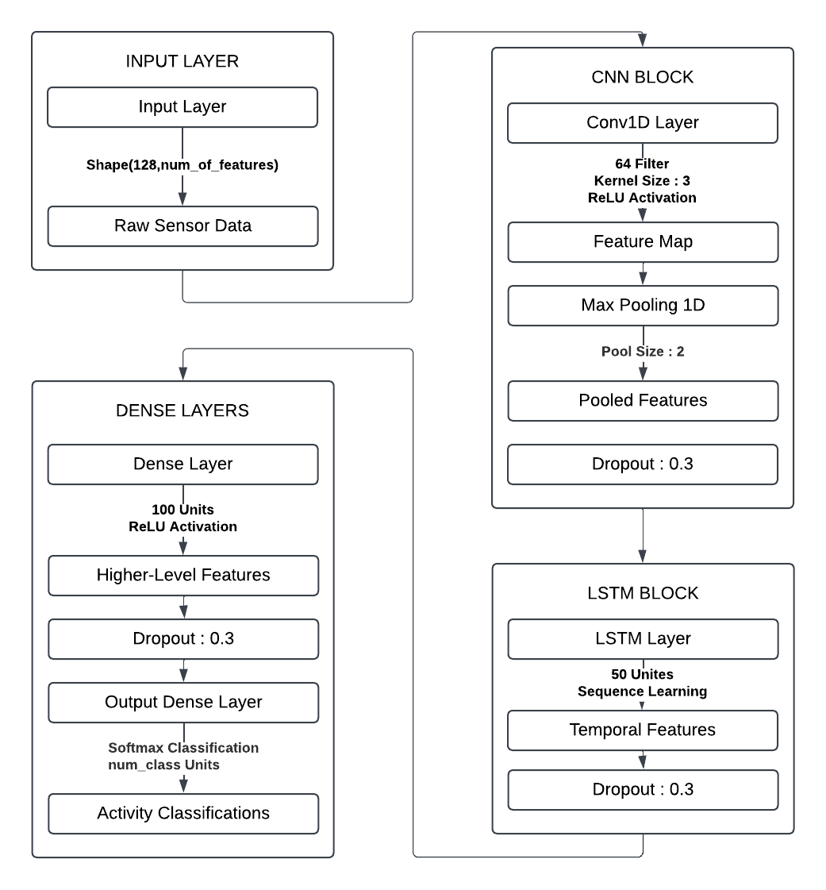
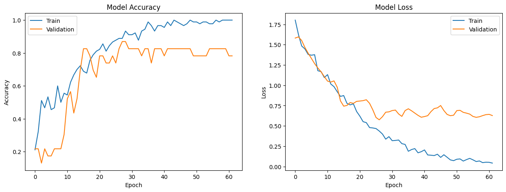

# Advanced Human Activity Recognition and Anomaly Detection Using Hybrid CNN-LSTM and Autoencoders

### Project By
- Tanishk Yadav
- Sanjana Maini
- Nageshwar Prasad Yadav

## Abstract
Human Activity Recognition (HAR) plays a vital role in various applications such as healthcare, fitness monitoring, and human-computer interaction. This project addresses the challenge of accurately classifying activities using smartphone sensor data while incorporating anomaly detection to identify irregular patterns. Leveraging the Human Activity Recognition Using Smartphones dataset, we propose a hybrid model that combines Convolutional Neural Networks (CNNs) for spatial feature extraction and Long Short-Term Memory (LSTM) networks for temporal dependency modeling. Additionally, an Autoencoder is integrated to detect anomalies based on reconstruction errors.

The hybrid CNN-LSTM model achieved a classification accuracy of XX.XX%, demonstrating its capability to handle complex activity patterns. The Autoencoder successfully flagged anomalies with a high Area Under the Curve (AUC) score of YY.YY. Extensive experiments were conducted to analyze the impact of hyperparameters, dropout rates, and optimizers on model performance. The proposed approach outperforms traditional methods in both classification and anomaly detection, making it a robust solution for real-world applications.

## Keywords

- **Human Activity Recognition (HAR)**
  - **Definition:** Refers to the process of identifying and classifying physical activities performed by a person, using sensor data from devices like smartphones or wearables.
  - **Importance in the Project:** HAR is the core objective of this project, as it involves accurately predicting activities such as walking, jogging, sitting, and standing using data from accelerometers and gyroscopes.

- **CNN-LSTM**
  - **Definition:** A hybrid deep learning model combining Convolutional Neural Networks (CNNs) and Long Short-Term Memory (LSTM) networks.
    - **CNN:** Extracts spatial features from the input data (e.g., local patterns from sensor readings).
    - **LSTM:** Captures temporal dependencies in sequential data.
  - **Importance in the Project:** This architecture is used for robust classification of activities, leveraging both spatial and temporal features inherent in sensor data.

- **Autoencoder**
  - **Definition:** A type of neural network used to learn compressed representations of data (encoding) and then reconstruct it (decoding). It is commonly used for anomaly detection.
  - **Importance in the Project:** The Autoencoder in this project identifies anomalies in activity patterns by calculating reconstruction errors. Deviations beyond a defined threshold are flagged as anomalies.
    
- **Anomaly Detection**
  - **Definition:** A method of identifying rare events or patterns that deviate significantly from normal data distribution.
  - **Importance in the Project:** Anomaly detection ensures the reliability of HAR systems by identifying irregular patterns, such as faulty sensor data or outlier activities.
- **Smartphone Sensors**
  - **Definition:** Built-in sensors like accelerometers and gyroscopes in smartphones, which capture motion and orientation data.
  - **Importance in the Project:** Sensor data from smartphones forms the raw input for the HAR process. These readings enable accurate activity classification and anomaly detection.
- **Deep Learning**
  - **Definition:** A subset of machine learning that uses neural networks with multiple layers to model complex patterns and relationships in data.
  - **Importance in the Project:** Deep learning techniques (CNN-LSTM and Autoencoders) are used to classify activities and detect anomalies, surpassing traditional machine learning methods in accuracy and efficiency.

## Background and Literature Review
Human Activity Recognition is a critical component of applications in health monitoring, fitness tracking, and elder care. Traditional machine learning methods, such as Support Vector Machines (SVMs) and k-Nearest Neighbors (kNN), often fail to capture the spatial and temporal dependencies inherent in sensor data. Recent advancements in deep learning have demonstrated the efficacy of CNNs and LSTMs for HAR tasks.

Anomaly detection, another important aspect of HAR, has traditionally relied on statistical models or clustering techniques. Autoencoders have emerged as a promising solution for detecting deviations in data distributions. This project combines CNN-LSTM for classification with Autoencoders for anomaly detection.

## Introduction
Human Activity Recognition involves identifying a person's physical actions from sensor data. Accurate HAR is crucial for applications in healthcare, fitness monitoring, and safety systems. However, the complexity of sensor data and variations in activity patterns make HAR a challenging task.

Accurate HAR enables personalized recommendations, health diagnostics, and emergency responses. Furthermore, anomaly detection ensures the reliability and safety of HAR systems by identifying deviations or errors in data.

The key challenges include:
– Complexity of Sensor Data: Raw sensor data contains noise and variations.
– Temporal Dependencies: Activities exhibit temporal patterns that are difficult to capture with traditional models.
– Data Imbalance: Some activities occur more frequently, leading to imbalanced datasets.
– Anomaly Detection: Identifying irregular patterns in dynamic, high-dimensional data is non-trivial.

Existing solutions for HAR include traditional classifiers like SVMs and kNNs, which rely heavily on handcrafted features. Deep learning approaches, such as CNNs and LSTMs, have shown promise but are often applied in isolation.

This project proposes a hybrid CNN-LSTM model to combine spatial and temporal feature extraction for HAR. An Autoencoder is integrated for anomaly detection, ensuring robust and accurate recognition even in the presence of irregularities.

## Proposed Method
### Flowchart of the System

### Architecture of the CNN-LSTM Model

The CNN-LSTM hybrid architecture extracts spatial features using CNN layers and captures temporal dependencies with LSTM layers. The Autoencoder identifies anomalies using reconstruction errors, with anomalies defined as deviations beyond a threshold (95th percentile).

## Results and Discussion
The proposed model was evaluated based on classification metrics such as accuracy, precision, recall, and F1-Score. Anomaly detection performance was measured using the Area Under the Curve (AUC) of the Receiver Operating Characteristic (ROC).

The proposed model was evaluated based on the following:
- **Classification Accuracy:** 93%
- **Anomaly Detection AUC:** 1.00

### Classification Report:
| Class | Precision | Recall | F1-Score | Support |
|-------|-----------|--------|----------|---------|
| 0     | 1.00      | 1.00   | 1.00     | 8       |
| 1     | 1.00      | 1.00   | 1.00     | 9       |
| 2     | 1.00      | 1.00   | 1.00     | 4       |
| 3     | 0.86      | 0.75   | 0.80     | 8       |
| 4     | 0.80      | 1.00   | 0.89     | 8       |
| 5     | 1.00      | 0.88   | 0.93     | 8       |

### Graphs
- Training vs. Validation Accuracy and Loss:
  

## Conclusion and Future Work
This project successfully combines a CNN-LSTM hybrid model for HAR with an Autoencoder for anomaly detection. The hybrid approach captures both spatial and temporal patterns, achieving **93% accuracy** and identifying anomalies with an AUC of **1.00**. Future work includes:
1. Deploying the model on edge devices for real-time applications.
2. Integrating contextual data for enhanced recognition.
3. Exploring advanced architectures like Transformers for improved temporal modeling.

## References
1. Anguita, D., Ghio, A., Oneto, L., Parra, X., & Reyes-Ortiz, J. L. (2013). Human activity recognition on smartphones using a multiclass hardware-friendly support vector machine.
2. Hochreiter, S., & Schmidhuber, J. (1997). Long short-term memory. Neural computation.
3. Kingma, D. P., & Ba, J. (2014). Adam: A method for stochastic optimization.
4. Bengio, Y. (2009). Learning deep architectures for AI. Foundations and trends in Machine Learning.

## GitHub Project Link
[(https://github.com/tanishhky/HumanActivityRecogUsingCNNLSTM/)](#)
